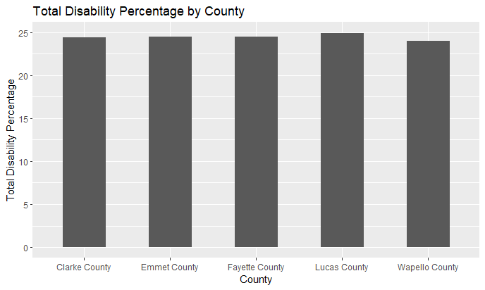
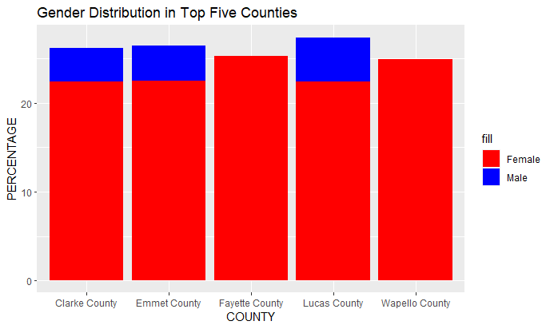
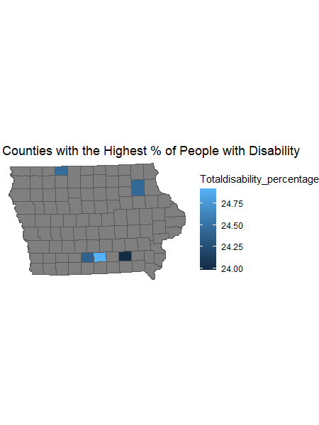

# Assignment 2

My analysis was on discovering counties in Iowa with the highest percentage of people with dsiability (from ages 35 and above)

## Second Chart
Here, I decided to show how the total percentage of disability is distributed between male and female gender from ages 35 and avove.

## Map
I decided to show the locations of those counties with the highest percentage of people with disability

