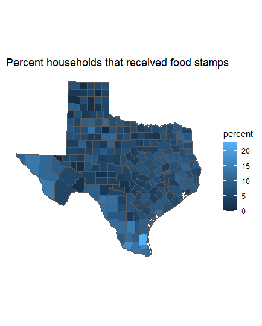
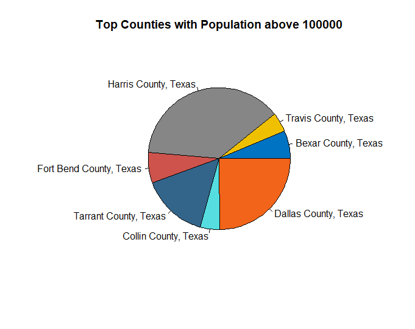
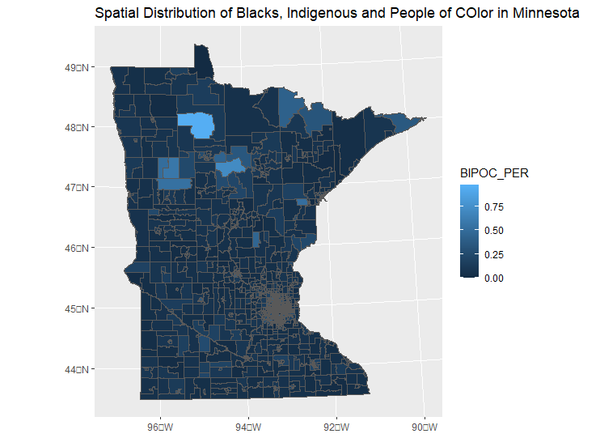

# Assignment 3

## Plot 1
First Plot displays the percentage of households that receive food stamps among the Black or African American only in Texas using Tidycensus

## Plot 2
The pie chart shows the counties in Texas with the highest number of black or african american in Texas using Tidycensus. "Highest number" is defined here as those counties above 100,000

## Plot 3
The third plot was developed using external data from a xlxs file and GIS shapefile. Specifically, the Map shows the spatial distribution of BIPOCs in Minnesota. This was achieved by getting the percentages of BIPOCS in each census tract, joining with Minnesota shapefile, and plotting with %BIPOC.

