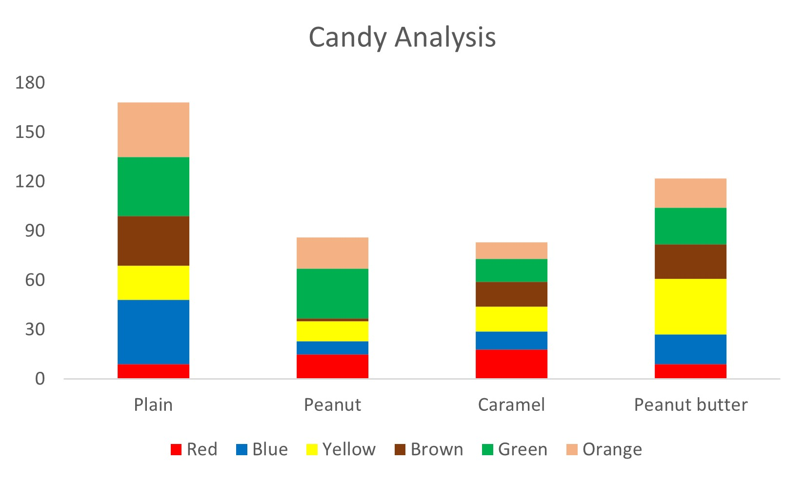

# This is my Exercise 1 file

Analysis of Flight Data: The data revealed that both scheduled and tracked flights were consistent with the least flights on Christmas and New Year's Day

Analysis of the candy data revealed that the plain bag had the highest number of candy pieces. This is followed by peanut butter bag, peanut bag, and caramel. The peanut butter bag had a noticeably higher yellow, while plain accounts for most blue. Green was more in the peanut bag, while caramel had more red

